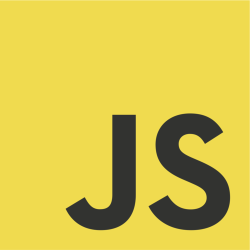
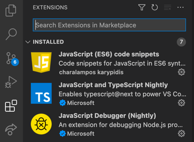

# backend-32190


En este repositorio van a poder acceder a todos los ejercicios de la clase hechos por el profesor

## Glosario

* [Clase 1](./clase-1) Clases 1
* [Clase 2](./clase-2) Clases 2
* [Clase 3](./clase-3) Clases 3
* [Clase 4](./clase-4) Clases 4
* [Clase 5](./clase-5) Clases 5
* [Clase 6](./clase-6) Clases 6
* [Clase 7](./clase-7) Clases 7
* [Clase 8](./clase-8) Clases 8
* [Clase 9](./clase-9) Clases 9
* [Clase 10](./clase-10) Clases 10
* [Clase 11](./clase-11) Clases 11
* [Clase 12](./clase-12) Clases 12
* [Clase 13](./clase-13) Clases 13
* [Clase 14](./clase-14) Clases 14
* [Clase 15](./clase-15) Clases 15
* [Clase 16](./clase-16) Clases 16
* [Clase 17](./clase-17) Clases 17
* [Clase 18](./clase-18) Clases 18
* [Instalacion Visual Studio Code](#instalacion-visual-studio-code)
* [Instalacion Node](#instalacion-node)
  * [Windows](#windows) 
  * [Mac/Linux](#maclinux)
* [NPM](#instalacion-visual-studio-code)
* [Ejercicios extras](#ejercicios-para-hacer-en-js
* [Profesor](#profesor)

## Instalacion Visual Studio Code
(Sos libre de utilizar cualquier IDE o editor de 
texto pero para estar alineado con la clase, 
sugerimos utilizar VSCode que es el que se utilizara 
en las clases)

* [Pagina de VSCode](https://code.visualstudio.com/download)

Algunas extensiones de VSCode para programar en JavaScript



## Instalacion Node

### Windows

* [Pagina de Node](https://nodejs.org/es/download/)

Descargar archivo y seguir los pasos de instalacion

(Recomendacion: Descargar version LTS que es la mas estable)

### Mac/Linux

#### Opcion 1:

* [Pagina de Node](https://nodejs.org/es/download/)
 #### Opcion 2:

```shell
brew install node
```

### Ejecutar con Node

En la terminal, estar parados en la carpeta donde esta el 
archivo que queremos ejecutar. (Suponiendo que el archivo
se llama main.js)

```shell
node index.js
```

## NPM

### Que es NPM?

NPM es el administrador de paquetes de NodeJS y nos sirve 
para instalar las librerias o dependencias que tenga
nuestro proyecto.

### Comandos de NPM

#### Crear proyecto con NPM

```
npm init           Create a package.json file
                   [--force|-f|--yes|-y|--scope]
                   [-y] es para iniciativas el servidor y que no haga las preguntas sobre autor y demás
```

#### Instalar Dependencias
```
npm install        install all the dependencies in your project
npm install <foo>  add the <foo> dependency to your project
                   [-g] (instalar dependencias global)
                   @version (1.0.0 o latest)
```

#### Ejecutar o testear con NPM
```
npm run <foo>      run the script named <foo>
npm test           run this project's tests
```

## Ejercicios para hacer en JS

https://www.jschallenger.com/

https://silentteacher.toxicode.fr

## Link Utiles

https://httpstatusdogs.com/

https://handlebarsjs.com/


### Contenido de las clases de Backend de CoderHouse

## Profesor
### Marcos Villanueva
#### marcosvillanueva009@gmail.com
